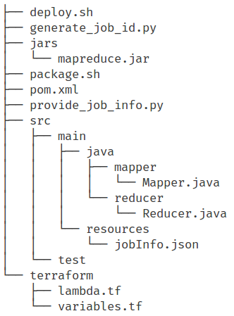

# Serverless MapReduce

This is a 100% serveless implementation of the MapReduce algorithm based on AWS Lambda. 

### Configuration steps

##### 1. Projet structure

The `mr_job` directory contains basic mandatory structure for any project using the framework.
The structure is as follows :



Below is a description of the files you need to understand to be able to run a job

- The class `mapper.Mapper` is the implementation of your mappers. It must extend the `mapper.MapperAbstract` class which looks like the following:

```java
public abstract class MapperAbstract {
    public abstract String map(BufferedReader objectBufferedReader);
}
```

The `map` method receives a `BufferedReader` as a parameter which is a reader of the batch part that the mapper lambda processes. The Reader closing is done internally for you.

- The class `reducer.Reducer` is the implementation of your reducers. It must extend the `reducer.ReducerAbstract` class which looks like the following:
  
```java
public abstract class ReducerAbstract {
    public abstract String reduce(List<ObjectInfoSimple> batch);
}
```

The `reduce` method receives a list of `ObjectInfoSimple` instances, which encapsulate information about the objects to be reduced such as the s3 source bucket and key.
The `ObjectInfoSimple` looks like this:

```java
public class ObjectInfoSimple {
    private String bucket;
    private String key;
    ...
}

```

You can use the utility method `Commons.getReaderFromObjectInfo(ObjectInfoSimple info)` to open a reader of the object passed as a parameter.
**For the reducer, you are responsible of closing the opened readers.**

- The `jsonInfo.json` file located at src/main/resources holds various configuration options of the job.

```json
{
  "jobId": "",
  "jobInputBucket": "big-dataset",
  "mapperOutputBucket": "big-dataset-map",
  "reducerOutputBucket": "big-dataset-reduce",
  "reducerFunctionName": "reducer",
  "mapperFunctionName": "mapper",
  "reducerMemory": "1536",
  "mapperMemory": "1536",
  "mapperForceBatchSize": "-1",
  "reducerForceBatchSize": "-1"
}
```

`jobId` is automatically instantiated.

`jobInputBucket` contains the batch parts that each lambda mapper will process.

`mapperOutputBucket` is the bucket where the mappers will put their results.

`reducerOutputBucket` is the bucket where the reducers will put their results.

`reducerMemory` and `mapperMemory` are the amount of memory(and other ressources) allocated to the lambda functions. They are used by the framework to compute the batch size that each mapper/reducer will process.

`mapperForceBatchSize` and `reducerForceBatchSize` are used to force the framework to use the specified batch size instead of automatically computing it. **`reducerForceBatchSize` must be greater or equal than 2**.
A less than 0 value means that the values will be automatically computed.

- The `pom.xml` must contain the framework dependency

```xml
    <dependencies>
    ...
        <dependency>
            <groupId>map_reduce</groupId>
            <artifactId>map_reduce</artifactId>
            <version>1</version>
        </dependency>
    ...
    </dependencies>
```

The dependency should ideally be in the maven repository, but for now we need it to be in our local repo.
This command should be able to do just that:

```commandline
mvn org.apache.maven.plugins:maven-install-plugin:2.3.1:install-file
            -Dfile=mr_job/jars/mapreduce.jar 
            -DgroupId=map_reduce 
            -DartifactId=map_reduce 
            -Dversion=1 
            -Dpackaging=jar 
            -DlocalRepositoryPath=~/.m2/repository/
```

You may add any dependency that your mapper and reducer rely on.

- The `deploy.sh` script is responsible of generating a new jobId and deploying necessary lambda functions and other infrastructure components

##### 2. Running the job

To run the job, enter the following command:
```commandline
  aws lambda invoke --function-name driver result
```

To successfully run the command, you need to install the aws cli: [Install AWS Cli](http://docs.aws.amazon.com/cli/latest/userguide/installing.html)

You also need to configure the cli: [Configure AWS Cli](http://docs.aws.amazon.com/cli/latest/userguide/cli-chap-getting-started.html)