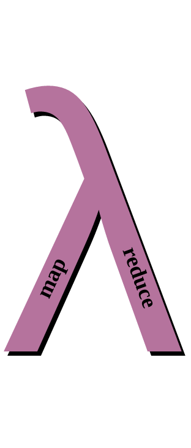
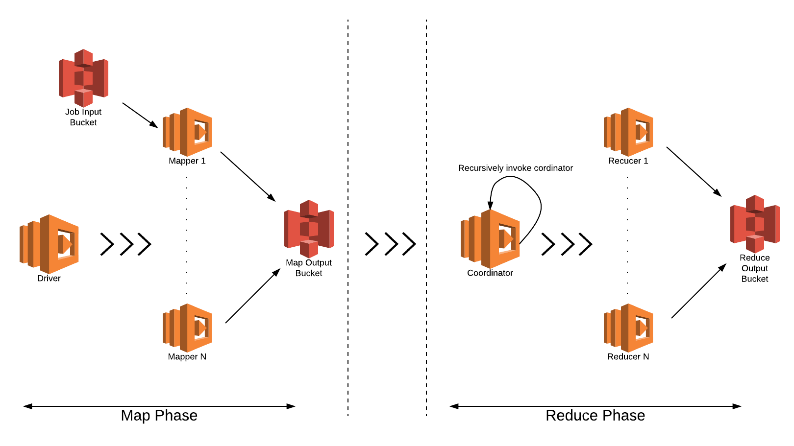

<p align="center">
  
</p>

[](https://travis-ci.org/d2si-oss/ooso)
[](https://search.maven.org/#artifactdetails%7Cfr.d2-si%7Cooso%7C0.0.1%7Cjar)

Ooso lets you run MapReduce jobs in a serverless way.
It is based on managed cloud services, [Amazon S3](https://aws.amazon.com/s3/) and [AWS Lambda](https://aws.amazon.com/lambda/) and is mainly an alternative to standard ad-hoc querying and batch processing tools such as [Hadoop](http://hadoop.apache.org/) and [Spark](http://spark.apache.org/) .

## Table of contents

  * [I-Architecture and workflow](#i-architecture-and-workflow)
  * [II-How to use the library](#ii-how-to-use-the-library)
    * [1-Project structure](#1-project-structure)
    * [2-Library dependency](#2-library-dependency)
    * [3-Classes to implement](#3-classes-to-implement)
    * [4-Configuration file](#4-configuration-file)
    * [5-Project packaging](#5-project-packaging)
  * [III-AWS Infrastructure](#iii-aws-infrastructure)
    * [1-S3 Buckets](#1-s3-buckets)
    * [2-IAM Roles and policies](#2-iam-roles-and-policies)
    * [3-Lambda functions](#3-lambda-functions)
    * [4-Deployment](#4-deployment)
  * [IV-Running the job](#iv-running-the-job)

___

## I-Architecture and workflow
<p align="center">
  
</p>

The library workflow is as follows:

1. The workflow begins by invoking the `Mappers Driver` lambda function
2. The `Mappers Driver` does two things:
    1. It computes batches of data splits and assigns each batch to a `Mapper`
    2. It invokes a `Mappers Listener` lambda function which is responsible of detecting the end of the map phase
3. Once the `Mappers Listener` detects the end of the map phase, it invokes a first instance of the `Reducers Driver` function
4. The `Reducers Driver` is somewhat similar to the `Mappers Driver`:
    1. It computes batches from either the `Map Output Bucket` if we are in the first step of the reduce phase, or from previous reducers outputs located in the `Reduce Output Bucket`. It then assigns each batch to a `Reducer`
    2. It also invokes a `Reducers Listener` for each step of the reduce phase.
5. Once the `Reducers Listener` detects the end of a reduce step, it decides whether to invoke the next `Reducers Driver` if the previous reduce step produced more than one file. Otherwise, there is no need to invoke a `Reducers Driver`, because the previous step would have produced one single file which is the result of the job

___

## II-How to use the library
### 1-Project Structure
The easiest way is to clone the repository and use the provided [example-project](example-project) directory which has the following structure:

```
.
├── package.sh
├── generate_job_id.py
├── provide_job_info.py
├── pom.xml
└── src
    └── main
        ├── java
        │   ├── mapper
        │   │   └── Mapper.java
        │   └── reducer
        │       └── Reducer.java
        └── resources
            └── jobInfo.json
```

### 2-Library dependency
Declare the library dependency in the `pom.xml` file

```xml
    <dependencies>
    ...
        <dependency>
            <groupId>fr.d2-si</groupId>
            <artifactId>ooso</artifactId>
            <version>0.0.1</version>
        </dependency>
    ...
    </dependencies>
```

### 3-Classes to implement
Implement your `Mapper` and `Reducer`.
- The class [Mapper](example-project/src/main/java/mapper/Mapper.java) is the implementation of your mappers. It must extend the `fr.d2si.ooso.mapper.MapperAbstract` class which looks like the following:
    ```java
    public abstract class MapperAbstract {
        public abstract String map(BufferedReader objectBufferedReader);
    }
    ```
    The `map` method receives a `BufferedReader` as a parameter which is a reader of the batch part that the mapper lambda processes. The Reader closing is done internally for you.

- The class [Reducer](example-project/src/main/java/reducer/Reducer.java) is the implementation of your reducers. It must extend the `fr.d2si.ooso.reducer.ReducerAbstract` class which looks like the following:
    ```java
    public abstract class ReducerAbstract {
        public abstract String reduce(List<ObjectInfoSimple> batch);
    }
    ```
    The `reduce` method receives a list of `ObjectInfoSimple` instances, which encapsulate information about the objects to be reduced .
    In order to get a reader from an  `ObjectInfoSimple` instance, you can do something like this:
    ```java
    public String reduce(List<ObjectInfoSimple> batch) {

        for (ObjectInfoSimple objectInfo : batch) {

            BufferedReader objectBufferedReader = Commons.getReaderFromObjectInfo(objectInfo);

            //do something with the reader then close it
            objectBufferedReader.close();
        }
    }
    ```
    **For the reducer, you are responsible of closing the opened readers.**

### 4-Configuration file
Edit the `jobInfo.json` file located at `src/main/resources` to reflect your [infrastructure](#iii-aws-infrastructure) details.
```json
{
    "jobId": "",
    "jobInputBucket": "input",
    "mapperOutputBucket": "mapper-output",
    "reducerOutputBucket": "reducer-output",
    "reducerFunctionName": "reducer",
    "mapperFunctionName": "mapper",
    "reducerMemory": "1536",
    "mapperMemory": "1536",
    "mapperForceBatchSize": "-1",
    "reducerForceBatchSize": "-1",
    "disableReducer": "false"
}
```

Below is the description of each attribute.

| Attribute| Description|
|-------------|-------------|
|jobId|Automatically set|
|jobInputBucket|Contains the dataset splits that each `Mapper` will process|
|mapperOutputBucket|The bucket where the mappers will put their results|
|reducerOutputBucket|The bucket where the reducers will put their results|
|reducerMemory and mapperMemory|The amount of memory(and therefore other resources) allocated to the lambda functions. They are used internally by the library to compute the batch size that each mapper/reducer will process.|
|mapperForceBatchSize and reducerForceBatchSize|Used to force the library to use the specified batch size instead of automatically computing it. **`reducerForceBatchSize` must be greater or equal than 2**|
|disableReducer|Tf set to "true", disables the reducer|

### 5-Project packaging
In order to generate the [jar](https://en.wikipedia.org/wiki/JAR_(file_format)) file used during the [deployment](#4-deployment) of the lambda, you need to [install maven](https://maven.apache.org/install.html).

Then, run `package.sh` script to generate the jobId and create the project jar:
```
./package.sh
```
___

## III-AWS Infrastructure
Before diving into the infrastructure details, please have a look at the [deployment](#4-deployment) section.
### 1-S3 Buckets
Our lambda functions use S3 Buckets to fetch needed files and put the result of their processing.

You need three buckets:

   - An input bucket containing your data splits
   - Two intermediary buckets used by the mappers and reducers

You must use the same bucket names used in the [configuration](#4-configuration-file) step above.

You may create the buckets using the [console](http://docs.aws.amazon.com/AmazonS3/latest/user-guide/create-bucket.html) , the [command line](http://docs.aws.amazon.com/cli/latest/reference/s3api/create-bucket.html) or our [Terraform template](./example-project/terraform/lambda.tf) .

### 2-IAM Roles and policies

1. Create an IAM role with the following trust policy:

    ```json
    {
        "Version": "2012-10-17",
        "Statement": [
            {
                "Effect": "Allow",
                "Principal": {
                    "Service": "lambda.amazonaws.com"
                },
                "Action": "sts:AssumeRole"
            }
        ]
    }
    ```

You may create the IAM role using the [console](http://docs.aws.amazon.com/IAM/latest/UserGuide/id_roles_create_for-service.html#roles-creatingrole-service-console) , the [command line](http://docs.aws.amazon.com/IAM/latest/UserGuide/id_roles_create_for-service.html#roles-creatingrole-service-cli) or our [Terraform template](./example-project/terraform/lambda.tf) .

2. Attach the following policies to your role:
    - `arn:aws:iam::aws:policy/AWSLambdaFullAccess`
    - `arn:aws:iam::aws:policy/AmazonS3FullAccess`

    Note that these policies are too broad. You may use more fine-grained policies/roles for each lambda.

You may attach the policies using the [console](http://docs.aws.amazon.com/IAM/latest/UserGuide/access_policies_managed-using.html) , the [command line](http://docs.aws.amazon.com/cli/latest/reference/iam/attach-role-policy.html) or our [Terraform template](./example-project/terraform/lambda.tf) .

### 3-Lambda functions
Create the required lambdas with the following details:

| Lambda Name   | Handler       |Memory|Function package|Runtime|
|-------------|-------------|----|----|----|
| mappers_driver| fr.d2si.ooso.mappers_driver.MappersDriver | 1536 |example-project/target/job.jar|java8|
| mappers_listener| fr.d2si.ooso.mappers_listener.MappersListener | 1536|example-project/target/job.jar|java8|
| mapper     | fr.d2si.ooso.mapper_wrapper.MapperWrapper | same used in the [configuration file](#4-configuration-file)  |example-project/target/job.jar|java8|
| reducers_driver| fr.d2si.ooso.reducers_driver.ReducersDriver | 1536|example-project/target/job.jar|java8|
| reducers_listener| fr.d2si.ooso.reducers_listener.ReducersListener | 1536|example-project/target/job.jar|java8|
| reducer     | fr.d2si.ooso.reducer_wrapper.ReducerWrapper | same used in the [configuration file](#4-configuration-file)  |example-project/target/job.jar|java8|

We assume that the project jar is located at `example-project/target/job.jar`.

You may attach the policies using the [console](http://docs.aws.amazon.com/lambda/latest/dg/getting-started-create-function.html) , the [command line](http://docs.aws.amazon.com/cli/latest/reference/lambda/create-function.html) or our [Terraform template](./example-project/terraform/lambda.tf) .

### 4-Deployment
1. The easy way

   We provide a fully functional Terraform template that creates everything for you, except the input bucket. This template uses the job configuration file.
   Here is how to use it:
    - [install Terraform](https://www.terraform.io/intro/getting-started/install.html)
    - make sure your job configuration file is correct
    - run the following commands
        ```
         cd terraform
         terraform plan
         terraform apply
        ```

For more info about Terraform, check [Terraform documentation](https://www.terraform.io/docs/) .

2. The less easy way

    You may use any deployment method you are familiar with. The AWS console, the AWS cli, python scripts, ...
    However we recommend using an Infrastructure-As-Code (IAC) tool such as [Terraform](https://www.terraform.io/) or [CloudFormation](aws.amazon.com/cloudformation‎) .
___

## IV-Running the job
All you need is to run the `mappers_driver` function
 ```
aws lambda invoke --function-name mappers_driver --invocation-type Event /dev/null
 ```

___

 <div>Icons made by <a href="http://www.freepik.com" title="Freepik">Freepik</a> from <a href="http://www.flaticon.com" title="Flaticon">www.flaticon.com</a> are licensed by <a href="http://creativecommons.org/licenses/by/3.0/" title="Creative Commons BY 3.0" target="_blank">CC 3.0 BY</a></div>
